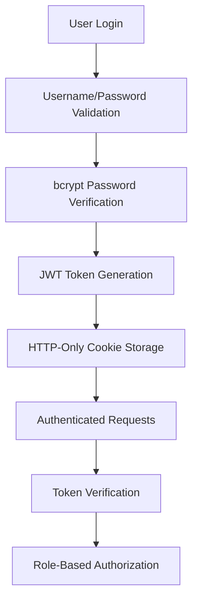

# Security and Authentication System Documentation

## Overview

The UFO Timeline application implements a JWT-based authentication system with HTTP-only cookies, bcrypt password hashing, and role-based access control. The security design prioritizes protection against common web vulnerabilities while maintaining development simplicity.

## Authentication Architecture

### Security Flow



### Components Overview

1. **Authentication Library** (`src/lib/auth.ts`): Core authentication functions
2. **API Routes** (`src/app/api/auth/*`): Authentication endpoints
3. **Middleware** (`src/middleware.ts`): Request interception (currently minimal)
4. **User Storage** (`src/data/users.json`): User credential storage
5. **Type Definitions** (`src/types/user.ts`): Authentication interfaces

## Authentication System Implementation

### Core Authentication Library (`src/lib/auth.ts`)

**User Management Functions**:

```typescript
// Read users from JSON file
export async function getUsers(): Promise<User[]> {
  try {
    const data = fs.readFileSync(USERS_FILE, 'utf-8');
    return JSON.parse(data);
  } catch (error) {
    console.error('Error reading users:', error);
    return [];
  }
}

// Find user by username
export async function findUserByUsername(username: string): Promise<User | null> {
  const users = await getUsers();
  return users.find(user => user.username === username) || null;
}
```

**Password Security**:

```typescript
// Verify password against bcrypt hash
export async function verifyPassword(password: string, hashedPassword: string): Promise<boolean> {
  return bcrypt.compare(password, hashedPassword);
}
```

**JWT Token Management**:

```typescript
// Generate JWT token with user claims
export function generateToken(user: User): string {
  return jwt.sign(
    { 
      id: user.id, 
      username: user.username, 
      email: user.email, 
      role: user.role 
    },
    JWT_SECRET,
    { expiresIn: '24h' }
  );
}

// Verify and decode JWT token
export function verifyToken(token: string): any {
  try {
    return jwt.verify(token, JWT_SECRET);
  } catch (error) {
    return null;
  }
}
```

### Authentication API Routes

**Login Endpoint** (`/api/auth/login`):

```typescript
export async function POST(request: NextRequest) {
  try {
    const { username, password } = await request.json();

    // Validate input
    if (!username || !password) {
      return NextResponse.json(
        { success: false, error: 'Username and password are required' },
        { status: 400 }
      );
    }

    // Find and verify user
    const user = await findUserByUsername(username);
    if (!user || !await verifyPassword(password, user.password)) {
      return NextResponse.json(
        { success: false, error: 'Invalid credentials' },
        { status: 401 }
      );
    }

    // Generate token and set HTTP-only cookie
    const token = generateToken(user);
    const response = NextResponse.json({
      success: true,
      user: {
        id: user.id,
        username: user.username,
        email: user.email,
        role: user.role
      }
    });

    response.cookies.set('auth-token', token, {
      httpOnly: true,
      secure: process.env.NODE_ENV === 'production',
      sameSite: 'strict',
      maxAge: 86400 // 24 hours
    });

    return response;
  } catch (error) {
    console.error('Login error:', error);
    return NextResponse.json(
      { success: false, error: 'Internal server error' },
      { status: 500 }
    );
  }
}
```

**Logout Endpoint** (`/api/auth/logout`):

```typescript
export async function POST() {
  const response = NextResponse.json({ success: true });
  
  // Clear the auth cookie
  response.cookies.set('auth-token', '', {
    httpOnly: true,
    secure: process.env.NODE_ENV === 'production',
    sameSite: 'strict',
    maxAge: 0
  });

  return response;
}
```

**Current User Endpoint** (`/api/auth/me`):

```typescript
export async function GET(request: NextRequest) {
  try {
    const token = request.cookies.get('auth-token')?.value;

    if (!token) {
      return NextResponse.json(
        { success: false, error: 'Not authenticated' },
        { status: 401 }
      );
    }

    const decoded = verifyToken(token);
    if (!decoded) {
      return NextResponse.json(
        { success: false, error: 'Invalid token' },
        { status: 401 }
      );
    }

    return NextResponse.json({
      success: true,
      user: {
        id: decoded.id,
        username: decoded.username,
        email: decoded.email,
        role: decoded.role
      }
    });
  } catch (error) {
    console.error('Auth check error:', error);
    return NextResponse.json(
      { success: false, error: 'Internal server error' },
      { status: 500 }
    );
  }
}
```

### User Data Model

**User Interface** (`src/types/user.ts`):

```typescript
export interface User {
  id: string;              // Unique identifier
  username: string;        // Login username
  email: string;           // Email address
  password: string;        // bcrypt hashed password
  role: 'admin' | 'user';  // Authorization level
  createdAt: string;       // ISO timestamp
}

export interface LoginRequest {
  username: string;
  password: string;
}

export interface AuthResponse {
  success: boolean;
  user?: {
    id: string;
    username: string;
    email: string;
    role: string;
  };
  error?: string;
}
```

**User Storage Format** (`src/data/users.json`):

```json
[
  {
    "id": "1",
    "username": "admin",
    "email": "admin@ufotimeline.com",
    "password": "$2b$10$09D5YGBY2Pnr0Kbaqq/N4.voygPllYarU5LZShyUbpMsd/PA0w3rS",
    "role": "admin",
    "createdAt": "2024-09-06T00:00:00.000Z"
  }
]
```

## Security Measures

### Password Security

**bcrypt Hashing**:
- **Algorithm**: bcrypt with salt rounds
- **Salt Rounds**: Default configuration (typically 10)
- **Comparison**: Secure constant-time comparison
- **Storage**: Never store plaintext passwords

```typescript
// Example password hashing (not in current codebase)
const saltRounds = 10;
const hashedPassword = await bcrypt.hash(password, saltRounds);
```

### JWT Token Security

**Token Configuration**:
- **Secret**: Environment variable `JWT_SECRET`
- **Algorithm**: HS256 (default jsonwebtoken)
- **Expiration**: 24 hours
- **Claims**: User ID, username, email, role

**Token Claims**:
```typescript
{
  id: user.id,
  username: user.username,
  email: user.email,
  role: user.role,
  iat: issued_at_time,
  exp: expiration_time
}
```

### Cookie Security

**HTTP-Only Cookies**:
```typescript
response.cookies.set('auth-token', token, {
  httpOnly: true,                                    // Prevents XSS access
  secure: process.env.NODE_ENV === 'production',    // HTTPS only in production
  sameSite: 'strict',                               // CSRF protection
  maxAge: 86400                                     // 24 hour expiration
});
```

**Security Benefits**:
- **XSS Protection**: JavaScript cannot access HTTP-only cookies
- **CSRF Protection**: SameSite=strict prevents cross-site requests
- **Transport Security**: Secure flag ensures HTTPS transmission
- **Time-based Expiry**: Automatic token invalidation

### Environment Variable Security

**JWT Secret Management**:
```typescript
const JWT_SECRET = process.env.JWT_SECRET || 'your-super-secret-jwt-key-for-development';
```

**Configuration Requirements**:
- **Development**: Use placeholder secret for convenience
- **Production**: Must use secure, randomly generated secret
- **Secret Rotation**: Periodic secret updates recommended
- **Length**: Minimum 256-bit (32 characters) recommended

## Authorization System

### Role-Based Access Control

**User Roles**:
```typescript
type UserRole = 'admin' | 'user';
```

**Role Permissions**:
- **Admin**: Full access to all features and admin endpoints
- **User**: Access to public features and user-specific data

### Route Protection

**Public Routes**:
- `/api/events` - Read UFO events
- `/api/events/[id]` - Read single event
- `/api/health` - System health check
- `/api/auth/login` - User authentication
- `/api/auth/logout` - User logout

**Protected Routes**:
- `/api/auth/me` - Current user info (requires authentication)
- `/api/admin/*` - All admin operations (requires admin role)

**Authentication Check Pattern**:
```typescript
// Standard authentication check
const token = request.cookies.get('auth-token')?.value;
if (!token) {
  return NextResponse.json({ error: 'Not authenticated' }, { status: 401 });
}

const decoded = verifyToken(token);
if (!decoded) {
  return NextResponse.json({ error: 'Invalid token' }, { status: 401 });
}

// Role-based check for admin routes
if (decoded.role !== 'admin') {
  return NextResponse.json({ error: 'Insufficient permissions' }, { status: 403 });
}
```

## Middleware Implementation

### Current Middleware (`src/middleware.ts`)

```typescript
export function middleware(request: NextRequest) {
  // Let API routes handle their own authentication
  // No middleware protection needed since API routes verify tokens directly
  return NextResponse.next();
}

export const config = {
  matcher: [],
};
```

**Design Decision**: 
- API routes handle authentication individually
- More granular control over authentication logic
- Easier to debug and customize per endpoint

### Alternative Middleware Approach (Future Enhancement)

```typescript
export function middleware(request: NextRequest) {
  const { pathname } = request.nextUrl;
  
  // Skip authentication for public routes
  if (pathname.startsWith('/api/events') || 
      pathname.startsWith('/api/health') ||
      pathname.startsWith('/api/auth')) {
    return NextResponse.next();
  }
  
  // Check authentication for protected routes
  if (pathname.startsWith('/api/admin')) {
    const token = request.cookies.get('auth-token')?.value;
    
    if (!token || !verifyToken(token)) {
      return NextResponse.json({ error: 'Unauthorized' }, { status: 401 });
    }
  }
  
  return NextResponse.next();
}

export const config = {
  matcher: ['/api/admin/:path*']
};
```

## Security Best Practices Implemented

### Input Validation
- **Required Fields**: Username and password validation
- **Type Checking**: TypeScript interface validation
- **Sanitization**: JSON parsing with error handling
- **Length Limits**: Implicit through bcrypt and JWT limits

### Error Handling
- **Generic Messages**: Avoid information disclosure
- **Logging**: Server-side error logging for debugging
- **Status Codes**: Proper HTTP status code usage
- **Fallbacks**: Graceful failure handling

### Session Management
- **Token Expiration**: 24-hour automatic expiry
- **Logout Mechanism**: Explicit cookie clearing
- **No Session Storage**: Stateless JWT approach
- **Concurrent Sessions**: Multiple device support

### Transport Security
- **HTTPS**: Secure cookie flag in production
- **Content-Type**: Proper API content type headers
- **CORS**: Implicit Next.js CORS handling
- **Headers**: Security headers via deployment configuration

## Security Considerations

### Current Limitations

**File-Based User Storage**:
- No password complexity requirements
- No account lockout mechanisms
- No password history
- No user registration endpoint

**Token Management**:
- No token refresh mechanism
- No token revocation
- Single secret for all tokens
- No rate limiting

**Audit and Monitoring**:
- No login attempt logging
- No suspicious activity detection
- No session monitoring
- No security event alerts

### Future Enhancements

**Enhanced Password Security**:
```typescript
// Password complexity validation
function validatePassword(password: string): boolean {
  return password.length >= 8 &&
         /[A-Z]/.test(password) &&
         /[a-z]/.test(password) &&
         /[0-9]/.test(password) &&
         /[^A-Za-z0-9]/.test(password);
}

// Account lockout mechanism
interface UserSecurity {
  failedAttempts: number;
  lockoutUntil?: Date;
  lastLogin?: Date;
}
```

**Token Refresh System**:
```typescript
// Refresh token implementation
interface TokenPair {
  accessToken: string;
  refreshToken: string;
}

// Short-lived access token with refresh capability
function generateTokenPair(user: User): TokenPair {
  return {
    accessToken: jwt.sign(userClaims, JWT_SECRET, { expiresIn: '15m' }),
    refreshToken: jwt.sign({ userId: user.id }, REFRESH_SECRET, { expiresIn: '7d' })
  };
}
```

**Rate Limiting**:
```typescript
// Login attempt rate limiting
const loginAttempts = new Map<string, { count: number; resetTime: number }>();

function checkRateLimit(ip: string): boolean {
  const attempts = loginAttempts.get(ip);
  const now = Date.now();
  
  if (!attempts || now > attempts.resetTime) {
    loginAttempts.set(ip, { count: 1, resetTime: now + 15 * 60 * 1000 }); // 15 minutes
    return true;
  }
  
  if (attempts.count >= 5) {
    return false;
  }
  
  attempts.count++;
  return true;
}
```

## Production Security Checklist

### Environment Configuration
- [ ] Strong JWT_SECRET (minimum 256-bit)
- [ ] Secure database credentials
- [ ] HTTPS enforcement
- [ ] Environment variable protection

### Access Control
- [ ] Admin account security review
- [ ] Role permission audit
- [ ] API endpoint protection verification
- [ ] File permission restrictions

### Monitoring and Logging
- [ ] Authentication failure logging
- [ ] Suspicious activity monitoring
- [ ] Error logging without sensitive data
- [ ] Security event alerting

### Infrastructure Security
- [ ] Docker container security scanning
- [ ] Dependency vulnerability assessment
- [ ] Network security configuration
- [ ] Backup and recovery procedures

This authentication system provides a solid foundation for the UFO Timeline application with industry-standard security practices while maintaining development simplicity and future extensibility.